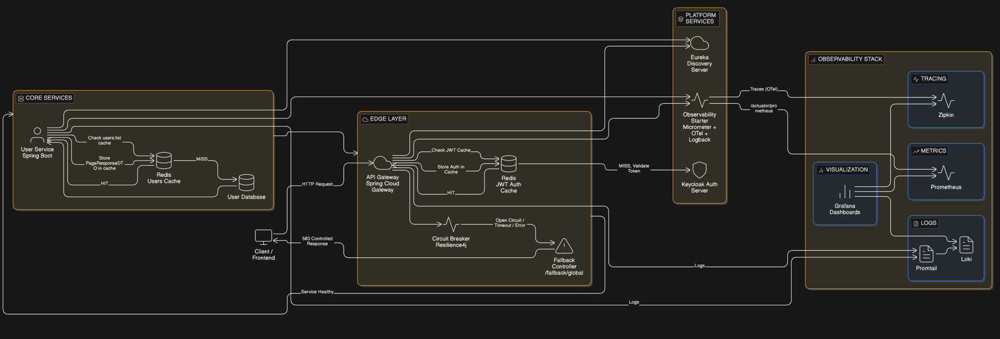

# 🚀 FastOrder Platform – Cloud-Native Microservices Architecture


---

## 📌 Visão Geral

A **FastOrder Platform** é uma arquitetura de microsserviços **cloud-native**, baseada em **Spring Boot 3 / Java 21**, projetada com foco em:

* Escalabilidade horizontal
* Segurança OAuth2/JWT
* Observabilidade ponta a ponta
* Padronização de erros
* Logging estruturado
* **Cache distribuído de alta performance**
* **Resiliência automática contra falhas**
* Boas práticas de design (DDD + Clean Architecture)

A plataforma utiliza **Gateway, serviços de domínio, service discovery, autenticação centralizada, Redis como camada de aceleração e Circuit Breaker para tolerância a falhas**.

---

# 🧩 Módulos do Projeto

| Módulo                    | Responsabilidade                                      |
| ------------------------- | ----------------------------------------------------- |
| **gateway**               | API Gateway reativo + cache JWT + Circuit Breaker     |
| **user-service**          | Microsserviço de usuários + cache de consultas        |
| **discovery-server**      | Eureka Service Discovery                              |
| **observability-starter** | Auto-configuração de logging, métricas e tracing      |
| **docker/**               | Infra local (Keycloak, Redis, Zipkin, Prometheus etc) |

---

# 🏗 Arquitetura Atualizada

### 🔥 Edge Cache + Domain Cache + Resilience Layer



---

## 🎯 O que a nova arquitetura adiciona

| Camada                        | Papel                                           |
| ----------------------------- | ----------------------------------------------- |
| **Redis (Gateway)**           | Cache de autenticação JWT                       |
| **Redis (User Service)**      | Cache de respostas paginadas                    |
| **Circuit Breaker (Gateway)** | Proteção contra falhas de microsserviços        |
| **Fallback Controller**       | Resposta controlada quando um serviço está down |
| **Keycloak**                  | Validação de tokens somente quando necessário   |

---

# ⚡ Camada de Cache Distribuído

A plataforma utiliza **Redis como camada de aceleração de leitura e autenticação**.

## 1️⃣ Cache de Autenticação no Gateway

Evita validações remotas repetidas do JWT.

```
Request → Gateway
   ↓
Token existe no cache?
   ↓ YES → autenticação imediata (~1ms)
   ↓ NO → valida no Keycloak → salva no Redis
```

| Benefício                       | Impacto       |
| ------------------------------- | ------------- |
| Redução de chamadas ao Keycloak | -90%          |
| Latência de autenticação        | ~100ms → ~2ms |
| Gateway continua stateless      | ✅             |

---

## 2️⃣ Cache de Lista de Usuários

Cacheia respostas paginadas.

| Cache        | TTL    | Conteúdo                |
| ------------ | ------ | ----------------------- |
| `users:list` | 2 min  | Página de usuários      |
| `auth:jwt`   | 10 min | Autenticação convertida |

---

# 🛡 Camada de Resiliência (Circuit Breaker)

O **Spring Cloud Gateway** agora protege todos os serviços com **Resilience4j**.

## 🎯 Objetivo

Evitar que falhas em um microsserviço:

* derrubem o gateway
* causem efeito cascata
* gerem timeout em massa
* afetem a experiência do usuário

---

## 🌐 Circuit Breaker Global

Configurado como **filtro padrão do gateway**, protegendo qualquer serviço registrado no Eureka.

```yaml
spring:
  cloud:
    gateway:
      discovery:
        locator:
          enabled: true
          lower-case-service-id: true
          predicates:
            - name: Path
              args:
                pattern: "'/'+serviceId+'/**'"
          filters:
            - name: RewritePath
              args:
                regexp: "'/'+serviceId+'/(?<remaining>.*)'"
                replacement: "'/${remaining}'"
      httpclient:
        connect-timeout: 2000
        response-timeout: 5s
      default-filters:
        - name: CircuitBreaker
          args:
            name: globalCB
            fallbackUri: forward:/fallback/global
```

---

## ⚙ Configuração Resilience4j

```yaml
resilience4j:
  circuitbreaker:
    instances:
      globalCB:
        slidingWindowSize: 20
        minimumNumberOfCalls: 10
        failureRateThreshold: 50
        waitDurationInOpenState: 15s
        permittedNumberOfCallsInHalfOpenState: 5
        automaticTransitionFromOpenToHalfOpenEnabled: true

  timelimiter:
    instances:
      globalCB:
        timeoutDuration: 3s
```

---

## 🚨 Fallback Inteligente

Quando um serviço está fora do ar:

```json
{
  "timestamp": "2026-01-31T03:24:41Z",
  "status": 503,
  "error": "SERVICE_UNAVAILABLE",
  "message": "Service temporarily unavailable. Please try again later.",
  "service": "user-service",
  "uriPath": "/v1/users/paged"
}
```

O gateway identifica automaticamente:

* qual serviço falhou
* qual rota foi chamada
* qual path original o cliente tentou acessar

---

# 🧠 Benefícios Arquiteturais

| Antes                   | Agora                                |
| ----------------------- | ------------------------------------ |
| JWT validado sempre     | JWT validado 1x e cacheado           |
| DB consultado sempre    | Leituras servidas do Redis           |
| Serviço down → erro 500 | Serviço down → fallback controlado   |
| Latência I/O bound      | Sistema CPU bound                    |
| Escalabilidade limitada | Escala horizontalmente               |
| Falhas causam cascata   | Falhas isoladas pelo Circuit Breaker |

---

# 👤 User Service

Agora inclui:

* Cache de consultas paginadas
* DTO de paginação (`PageResponseDTO`)
* MapStruct com conversão Page → DTO

---

# 🔐 Segurança

✔ Validação JWT
✔ Cache de autenticação
✔ Conversão de roles Keycloak
✔ Tratamento global de exceções de segurança

---

# ❤️ Observabilidade

Mesmo com cache e fallback:

| Tipo       | Ferramenta |
| ---------- | ---------- |
| Tracing    | Zipkin     |
| Métricas   | Prometheus |
| Logs       | Loki       |
| Dashboards | Grafana    |

---

# 🐳 Infraestrutura Local

| Serviço    | Porta |
| ---------- | ----- |
| Redis      | 6379  |
| Keycloak   | 8085  |
| Eureka     | 8761  |
| Zipkin     | 9411  |
| Prometheus | 9090  |
| Grafana    | 3000  |

---

# 📈 Evolução recente

| Feature                               | Status |
| ------------------------------------- | ------ |
| CRUD de usuários                      | ✅      |
| Swagger customizado                   | ✅      |
| Tratamento global de erros            | ✅      |
| Validação amigável                    | ✅      |
| Logging estruturado                   | ✅      |
| Testes automatizados                  | ✅      |
| Observability Starter                 | ✅      |
| Cache Redis distribuído               | ✅      |
| JWT Auth Cache no Gateway             | ✅      |
| Cache de consultas paginadas          | ✅      |
| **Circuit Breaker Global**            | ✅      |
| **Fallback automático por serviço**   | ✅      |
| **Proteção contra falhas em cascata** | ✅      |
