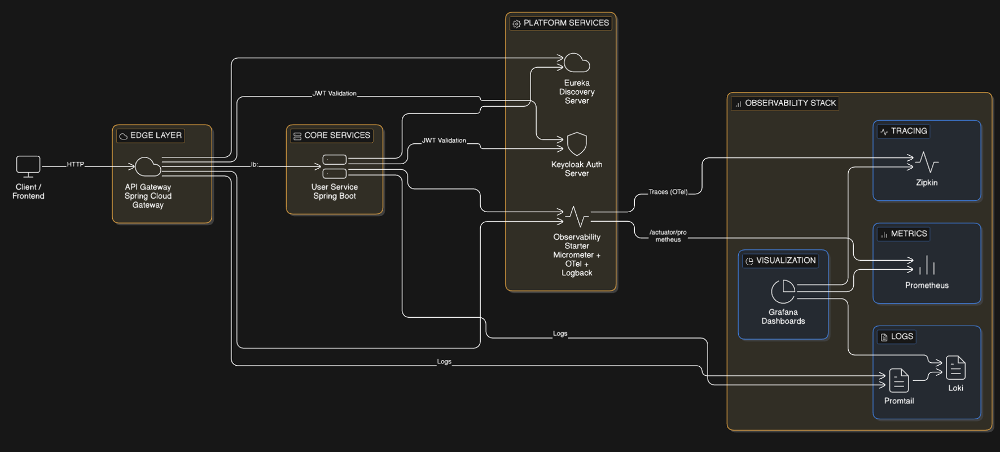

# 🚀 FastOrder Platform – Cloud-Native Microservices Architecture


## 📌 Visão Geral

A **FastOrder Platform** é uma arquitetura de microsserviços **cloud-native** baseada em **Spring Boot 3 / Java 21**, projetada com foco em:

* Escalabilidade
* Observabilidade
* Segurança OAuth2/JWT
* Padronização de erros
* Logging estruturado
* Boas práticas de design (DDD + Clean Architecture)

A plataforma é composta por **Gateway, serviços de domínio, service discovery e um starter de observabilidade reutilizável**.

---

# 🧩 Módulos do Projeto

| Módulo                    | Responsabilidade                                    |
| ------------------------- | --------------------------------------------------- |
| **gateway**               | API Gateway reativo (WebFlux)                       |
| **user-service**          | Microsserviço de usuários (Spring MVC)              |
| **discovery-server**      | Eureka Service Discovery                            |
| **observability-starter** | Auto-configuração de logging, métricas e tracing    |
| **docker/**               | Infraestrutura local (Keycloak, Zipkin, Prometheus) |

---


## 🏗 Arquitetura da Plataforma



---

## 🎯 O que o diagrama mostra

| Camada | Papel |
|--------|------|
| **Client** | Consumidor da API |
| **Gateway** | Roteamento, segurança, logging |
| **User Service** | Domínio de usuários |
| **Eureka** | Service discovery |
| **Keycloak** | Autenticação e autorização |
| **Observability Starter** | Logging + métricas + tracing |
| **Zipkin** | Distributed tracing |
| **Prometheus** | Coleta de métricas |

---

## 🧠 Benefícios arquiteturais evidenciados

- API Gateway como **ponto único de entrada**
- Comunicação via **Service Discovery**
- Segurança centralizada com **OAuth2/JWT**
- Observabilidade desacoplada via **starter reutilizável**
- Arquitetura pronta para **escala horizontal**

---

### Infraestrutura de Suporte

| Componente | Função                      |
| ---------- | --------------------------- |
| Keycloak   | Authorization Server (OIDC) |
| Eureka     | Service Discovery           |
| Zipkin     | Distributed Tracing         |
| Prometheus | Métricas                    |
| Actuator   | Health & Metrics            |

---

# 🚪 API Gateway

Tecnologias:

* Spring Cloud Gateway
* Spring Security WebFlux
* JWT Resource Server
* Filtros globais reativos
* Logging de tráfego
* Tratamento global de erros

### Responsabilidades

| Camada            | Função                           |
| ----------------- | -------------------------------- |
| Routing           | Roteamento reativo               |
| Security          | Validação de JWT                 |
| Filters           | Logging de requisições/respostas |
| Exception Handler | Erros padronizados               |

---

# 👤 User Service

Microsserviço responsável pelo domínio de usuários.

### Stack

* Spring Boot MVC
* Spring Security Resource Server
* JPA + Repository Pattern
* MapStruct
* Bean Validation avançado
* Swagger customizado
* Testes unitários e de camada web

---

## ✅ Validação de Dados (Feature nova)

Implementação de **validação amigável e profissional**, com:

* Mensagens centralizadas (`ValidationMessages.properties`)
* Resolução de nomes amigáveis de campos
* Estrutura de erro consistente
* Suporte a múltiplos erros por campo

### Exemplo de erro de validação

```json
{
  "timestamp": "2026-01-26T16:36:14Z",
  "status": 400,
  "error": "Bad Request",
  "message": "Validation failed",
  "path": "/api/v1/users",
  "validationErrors": [
    {
      "field": "Email",
      "message": "Please provide a valid Email address",
      "constraint": "Email"
    }
  ]
}
```

### Componentes envolvidos

| Classe                       | Papel                          |
| ---------------------------- | ------------------------------ |
| `ValidationConfig`           | Configura MessageSource        |
| `FriendlyFieldErrorResolver` | Traduz nome técnico → amigável |
| `GlobalExceptionHandler`     | Monta resposta padronizada     |
| `ApiErrorResponseWriter`     | Escrita de erro de segurança   |

---

# 🧾 Padronização de Erros

Todos os serviços seguem o mesmo contrato:

```json
{
  "timestamp": "...",
  "status": 400,
  "error": "Bad Request",
  "message": "Validation failed",
  "path": "/api/...",
  "validationErrors": []
}
```

Erros cobertos:

| Tipo            | HTTP |
| --------------- | ---- |
| Validação       | 400  |
| Não encontrado  | 404  |
| Não autenticado | 401  |
| Acesso negado   | 403  |
| Erro interno    | 500  |

---

# 🔐 Segurança

Todos os serviços funcionam como **OAuth2 Resource Server**.

```yaml
spring.security.oauth2.resourceserver.jwt.issuer-uri:
  http://localhost:8085/realms/fastorder
```

JWT é validado quanto a:

* Assinatura
* Issuer
* Expiração
* Roles

---

# 🔍 Logging Estruturado

Implementado nos serviços e no gateway:

### Gateway

```
SECURITY GET /admin/routes -> 403 FORBIDDEN (9 ms)
ROUTED POST /api/users -> user-service (32 ms)
```

### User Service

```
Validation failed → email: must be a well-formed email address
```

---

# ❤️ Observabilidade (Starter próprio)

O módulo **observability-starter** fornece:

* Propagação MDC reativa
* Configuração padrão de logs
* Estrutura para métricas
* Estrutura para tracing

Pode ser reutilizado em qualquer microsserviço futuro.

---

# 🧪 Testes Automatizados

Cobertura em múltiplas camadas:

| Tipo                  | Implementado |
| --------------------- | ------------ |
| Controller tests      | ✅            |
| Service tests         | ✅            |
| Mapper tests          | ✅            |
| Security config tests | ✅            |

Ferramentas:

* JUnit 5
* Mockito
* AssertJ
* Spring Boot Test

---

# 🐳 Infraestrutura Local

Subida completa:

```bash
docker compose -f docker/docker-compose.yml up
docker compose -f docker/docker-compose-observability.yml up
```

| Serviço  | Porta |
| -------- | ----- |
| Keycloak | 8085  |
| Eureka   | 8761  |
| Zipkin   | 9411  |

---

# ⚙ Perfis

| Profile | Uso                  |
| ------- | -------------------- |
| local   | Ambiente completo    |
| dev     | Desenvolvimento      |
| test    | Testes automatizados |

---

# 🚀 Tecnologias

* Java 21
* Spring Boot 3
* Spring Cloud Gateway
* Spring Security OAuth2
* Spring Data JPA
* MapStruct
* OpenAPI / Swagger
* Eureka
* Keycloak
* Zipkin
* Prometheus
* Docker

---

# 📈 Evolução recente

Últimas features implementadas:

* ✅ CRUD completo de usuários
* ✅ Swagger customizado
* ✅ Tratamento global de erros
* ✅ Validação amigável
* ✅ Logging estruturado
* ✅ Testes automatizados
* ✅ Starter de observabilidade

---
