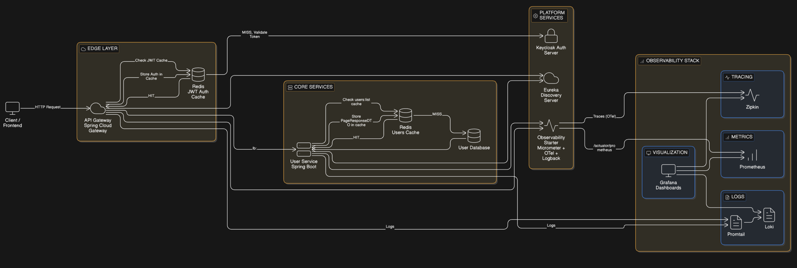

# 🚀 FastOrder Platform – Cloud-Native Microservices Architecture


---

## 📌 Visão Geral

A **FastOrder Platform** é uma arquitetura de microsserviços **cloud-native**, baseada em **Spring Boot 3 / Java 21**, projetada com foco em:

* Escalabilidade
* Segurança OAuth2/JWT
* Observabilidade ponta a ponta
* Padronização de erros
* Logging estruturado
* **Cache distribuído de alta performance**
* Boas práticas de design (DDD + Clean Architecture)

A plataforma utiliza **Gateway, serviços de domínio, service discovery, autenticação centralizada e Redis como camada de aceleração**.

---

# 🧩 Módulos do Projeto

| Módulo                    | Responsabilidade                                      |
| ------------------------- | ----------------------------------------------------- |
| **gateway**               | API Gateway reativo + cache de autenticação JWT       |
| **user-service**          | Microsserviço de usuários + cache de consultas        |
| **discovery-server**      | Eureka Service Discovery                              |
| **observability-starter** | Auto-configuração de logging, métricas e tracing      |
| **docker/**               | Infra local (Keycloak, Redis, Zipkin, Prometheus etc) |

---

# 🏗 Arquitetura Atualizada

### 🔥 Agora com Edge Cache + Domain Cache



---

## 🎯 O que o novo desenho adiciona

| Camada                   | Papel                                        |
| ------------------------ | -------------------------------------------- |
| **Redis (Gateway)**      | Cache de autenticação JWT                    |
| **Redis (User Service)** | Cache de resultados paginados                |
| **DB**                   | Source of truth                              |
| **Keycloak**             | Validação de tokens apenas quando necessário |

---

# ⚡ Nova Camada de Cache Distribuído

A plataforma agora utiliza **Redis como camada de aceleração de leitura e autenticação**.

## 1️⃣ Cache de Autenticação no Gateway

Evita validação remota repetida do JWT.

### Fluxo

```
Request → Gateway
   ↓
Token existe no cache?
   ↓ YES → autenticação imediata (~1ms)
   ↓ NO → valida no Keycloak → salva no Redis
```

| Benefício                       | Impacto       |
| ------------------------------- | ------------- |
| Redução de chamadas ao Keycloak | -90%          |
| Latência de autenticação        | ~100ms → ~2ms |
| Gateway continua stateless      | ✅             |

---

## 2️⃣ Cache de Lista de Usuários

Cacheia respostas paginadas (`PageResponseDTO<UserResponseDTO>`).

| Cache        | TTL    | Conteúdo                |
| ------------ | ------ | ----------------------- |
| `users:list` | 2 min  | Página de usuários      |
| `auth:jwt`   | 10 min | Autenticação convertida |

### Estratégia aplicada

* Cache armazena **DTOs**, nunca `PageImpl`
* Serialização JSON tipada
* TTL por criticidade
* Redis como camada L2

---

# 🧠 Benefícios Arquiteturais

| Antes                   | Agora                      |
| ----------------------- | -------------------------- |
| JWT validado sempre     | JWT validado 1x e cacheado |
| DB consultado sempre    | Leituras servidas do Redis |
| Latência I/O bound      | Sistema CPU bound          |
| Escalabilidade limitada | Escala horizontalmente     |

---

# 👤 User Service

Agora inclui:

* Cache de consultas paginadas
* DTO de paginação (`PageResponseDTO`)
* MapStruct com conversão Page → DTO

---

# 🔐 Segurança

Todos os serviços são **OAuth2 Resource Server**.

Agora com:

✔ Validação JWT
✔ Cache de autenticação
✔ Conversão de roles Keycloak
✔ Tratamento global de exceções de segurança

---

# ❤️ Observabilidade

Mesmo com cache, toda telemetria continua:

| Tipo       | Ferramenta |
| ---------- | ---------- |
| Tracing    | Zipkin     |
| Métricas   | Prometheus |
| Logs       | Loki       |
| Dashboards | Grafana    |

---

# 🐳 Infraestrutura Local Atualizada

Agora inclui Redis:

| Serviço    | Porta |
| ---------- | ----- |
| Redis      | 6379  |
| Keycloak   | 8085  |
| Eureka     | 8761  |
| Zipkin     | 9411  |
| Prometheus | 9090  |
| Grafana    | 3000  |

---

# 📈 Evolução recente

| Feature                          | Status |
| -------------------------------- | ------ |
| CRUD de usuários                 | ✅      |
| Swagger customizado              | ✅      |
| Tratamento global de erros       | ✅      |
| Validação amigável               | ✅      |
| Logging estruturado              | ✅      |
| Testes automatizados             | ✅      |
| Observability Starter            | ✅      |
| **Cache Redis distribuído**      | ✅      |
| **JWT Auth Cache no Gateway**    | ✅      |
| **Cache de consultas paginadas** | ✅      |


